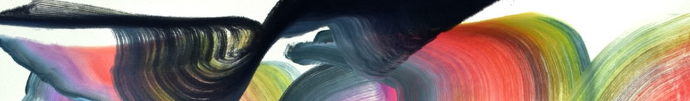

```{=html}
<style>
  /* ===== COLOR PALETTE — edit to re-theme ===== */
  :root {
    --step1: #dab7d3;   /* Explore (INTRO, EDA) */
    --step2: #999f24;   /* Data Prep (DATA) */
    --step3: #bc83d3;   /* Algorithms (CLS, TREE, LIN, MOD, NN) */
    --step4: #b83912;   /* Train (ESB) */
    --step5: #7f1e15;   /* Evaluate (EVL) */
    --agenda-grey: #e4e2e6;  /* non-quiz agenda buttons */
    --on-light: #1a1a1a;
    --on-dark:  #ffffff;
  }
  .topic-btn { display:inline-flex; padding:3px 10px; border-radius:999px; width:100%; justify-content: center;
    font-weight:700; font-size:0.85rem; text-decoration:none; line-height:1.5;
    box-shadow:0 1px 3px rgba(0,0,0,0.18); color:var(--on-light); }
  .ag-btn { display:inline-block; margin:2px 0; padding:2px 10px; border-radius:6px;
    font-weight:600; font-size:0.78rem; text-decoration:none; line-height:1.5;
    box-shadow:0 1px 2px rgba(0,0,0,0.12); }
  a.topic-btn:hover, a.ag-btn:hover { filter:brightness(0.97); text-decoration:none; }
  .ag-grey { background:var(--agenda-grey); color:#333; }
  .step1 { background:var(--step1); color:var(--on-light); }
  .step2 { background:var(--step2); color:var(--on-light); }
  .step3 { background:var(--step3); color:var(--on-light); }
  .step4 { background:var(--step4); color:var(--on-dark); }
  .step5 { background:var(--step5); color:var(--on-dark); }
</style>
```



## September

[INTRO]{.topic-btn .step1} 

| **date**  | **agenda** | **upcoming** |
|:---:|:---|:----|
| Th Sept 10 |   [syllabus](syllabus.qmd){.ag-btn .ag-grey} [Lab: Intro](../content/06-OTHER.qmd#intro-lab){.ag-btn .ag-grey}| INTRO lab due Saturday<br>Skim next module  |


[EDA](../content/01-EDA.qmd){.topic-btn .step1}  

|||
|:---:|:---|:----|
| T Sept 15 |  [EDA1](../content/01-EDA.qmd#slides){.ag-btn .ag-grey} [PC0](../project.qmd#pc0){.ag-btn .ag-grey} [Quiz: INTRO]{.ag-btn .step1} | PC0 due Wednesday |
| Th Sept 17 |   [EDA2](../content/01-EDA.qmd#slides){.ag-btn .ag-grey} [HW: EDA](../content/01-EDA.qmd){.ag-btn .ag-grey} [PC1](../project.qmd#pc1){.ag-btn .ag-grey} | PC1 due Saturday |
| T Sept 22 |   [EDA3](../content/01-EDA.qmd#slides){.ag-btn .ag-grey} [Lab: EDA](../content/01-EDA.qmd){.ag-btn .ag-grey} | Article review 1 due Saturday <br> Skim next module  |

[EVL](../content/05-EVAL.qmd){.topic-btn .step5} 

|||
|:---:|:---|:----|
| Th Sept 24 |   [EVL1](../content/05-EVAL.qmd#slides){.ag-btn .ag-grey} [HW: EVL](../content/05-EVAL.qmd){.ag-btn .ag-grey} [PC2](../project.qmd#pc2){.ag-btn .ag-grey}| EDA HW + Lab due Saturday<br>Study for EDA quiz |
| T Sept 29 |   [EVL2](../content/05-EVAL.qmd#slides){.ag-btn .ag-grey} [HW: EVL](../content/05-EVAL.qmd){.ag-btn .ag-grey} [Quiz: EDA](../content/01-EDA.qmd#standards){.ag-btn .step1} | PC2 due Wednesday |

## October

| **date**  | **agenda** | **upcoming** |
|:---:|:---|:---|
| Th Oct 1 | [EVL3](../content/05-EVAL.qmd#slides){.ag-btn .ag-grey} [Lab: EVL](../content/05-EVAL.qmd){.ag-btn .ag-grey} | EVAL HW + Lab due Saturday<br>Study for EVL quiz <br> Skim next module |

[CLS](../content/03-ALG.qmd#cls){.topic-btn .step3} 

|||
|:---:|:---|:---|
| T Oct 6 |  [CLS1](../content/03-ALG.qmd#cls-slides){.ag-btn .ag-grey} [PC3](../project.qmd#pc3){.ag-btn .ag-grey} [Quiz: EVL](../content/05-EVAL.qmd#standards){.ag-btn .step5} | PC3 due Wednesday |
| Th Oct 8 |  [CLS2](../content/03-ALG.qmd#cls-slides){.ag-btn .ag-grey} [HW: CLS](../content/03-ALG.qmd#cls){.ag-btn .ag-grey} |  |
| T Oct 13 |  **Fall Break** |  |
| Th Oct 15  | [CLS3](../content/03-ALG.qmd#cls-slides){.ag-btn .ag-grey} [Lab: CLS](../content/03-ALG.qmd#cls){.ag-btn .ag-grey} | CLS HW + Lab due Saturday<br>Study for CLS quiz <br> Skim next module |

[DATA](../content/02-DATA.qmd){.topic-btn .step2} 

|||
|:---:|:---|:---|
| T Oct 20 |  [DATA1](../content/02-DATA.qmd#slides){.ag-btn .ag-grey} [Quiz: CLS](../content/03-ALG.qmd#cls-standards){.ag-btn .step3} | [Sign up](https://docs.google.com/forms/d/e/1FAIpQLSfR-lWP6ZGMbUYw_Zq4Pw8kJn8gYsjL5nun4cvbkPWpYRipSA/viewform?usp=share_link&ouid=101535206594689312428) for retakes if applicable |
| W Oct 21 |  [Quiz Retakes: INTRO EDA EVL]{.ag-btn .ag-grey} |  |
| Th Oct 22 | [DATA2](../content/02-DATA.qmd#slides){.ag-btn .ag-grey} [HW: DATA](../content/02-DATA.qmd){.ag-btn .ag-grey} [PC4](../project.qmd#pc4){.ag-btn .ag-grey} | PC4 due Saturday <br> Skim next module |

[TREE](../content/03-ALG.qmd#tree){.topic-btn .step3} 

|||
|:---:|:---|:---|
| T Oct 27 | [TREE1](../content/03-ALG.qmd#tree-slides){.ag-btn .ag-grey} [Lab: DATA](../content/02-DATA.qmd){.ag-btn .ag-grey} | Article review 2 due Wednesday |
| Th Oct 29  | [TREE2](../content/03-ALG.qmd#tree-slides){.ag-btn .ag-grey} [HW: TREE](../content/03-ALG.qmd#tree){.ag-btn .ag-grey} [PC5](../project.qmd#pc5){.ag-btn .ag-grey} | DATA HW + Lab due Saturday<br>Study for DATA quiz |

## November

| **date** | **agenda** | **upcoming** |
|:---:|:---|:---|
| T Nov 3 | [TREE3](../content/03-ALG.qmd#tree-slides){.ag-btn .ag-grey} [Quiz: DATA](../content/02-DATA.qmd#standards){.ag-btn .step2} | PC5 due Wednesday <br>Skim next module|

[LIN](../content/03-ALG.qmd#lin){.topic-btn .step3}

|||
|:---:|:---|:---|
| Th Nov 5 | [LIN1](../content/03-ALG.qmd#lin-slides){.ag-btn .ag-grey} [Lab: TREE](../content/03-ALG.qmd#tree){.ag-btn .ag-grey} | TREE HW + Lab due Saturday<br>Study for TREE quiz |
| T Nov 10 |  [LIN2](../content/03-ALG.qmd#lin-slides){.ag-btn .ag-grey} [HW: LIN](../content/03-ALG.qmd#lin){.ag-btn .ag-grey} [Quiz: TREE](../content/03-ALG.qmd#tree-standards){.ag-btn .step3} | Skim next module |

[MOD](../content/03-ALG.qmd#mod){.topic-btn .step3} 

|||
|:---:|:---|:---|
| Th Nov 12 |  [MOD1](../content/03-ALG.qmd#mod-slides){.ag-btn .ag-grey} [Lab: LIN](../content/03-ALG.qmd#lin){.ag-btn .ag-grey} | LIN HW due Saturday |
| T Nov 17  | [MOD2](../content/03-ALG.qmd#mod-slides){.ag-btn .ag-grey} [HW: MOD](../content/03-ALG.qmd#mod){.ag-btn .ag-grey} [Quiz: LIN](../content/03-ALG.qmd#lin-standards){.ag-btn .step3} | MOD HW due Saturday<br>Study for LIN quiz <br> Skim next module|

[ESB](../content/04-TRAIN.qmd){.topic-btn .step4} 

|||
|:---:|:---|:---|
| Th Nov 19 |  [ESB1](../content/04-TRAIN.qmd#slides){.ag-btn .ag-grey} [HW: ESB](../content/04-TRAIN.qmd){.ag-btn .ag-grey} [PC6](../project.qmd#pc6){.ag-btn .ag-grey} | ESB HW due Tuesday |
| T Nov 24 |  [ESB2](../content/04-TRAIN.qmd#slides){.ag-btn .ag-grey} [Lab: ESB Part 1](../content/04-TRAIN.qmd){.ag-btn .ag-grey} | ESB LAB Part1 due Monday |
| Th Nov 26 | | **Thanksgiving Break**  |  |

## December

| **date**  | **agenda** | **upcoming** |
|:---:|:---|:---|
| T Dec 1 |  [ESB3](../content/04-TRAIN.qmd#slides){.ag-btn .ag-grey} [Lab: ESB Part 2](../content/04-TRAIN.qmd){.ag-btn .ag-grey} | PC6 due Thursday<br> [Sign up]() for retakes if applicable  |
| W Dec 2 | [Quiz Retakes<br> CLS DATA TREE LIN]{.ag-btn .ag-grey} | skim next module |

[NN](../content/03-ALG.qmd#nn){.topic-btn .step3}

|||
|:---:|:---|:---|
| Th Dec 3  | [NN1](../content/03-ALG.qmd#nn-slides){.ag-btn .ag-grey} [HW: NN](../content/03-ALG.qmd#nn){.ag-btn .ag-grey} [PC7-9](../project.qmd#pc7){.ag-btn .ag-grey} | ESB LAB Part2 due Saturday <br> Study for ESB quiz |
| T Dec 8 | [NN2](../content/03-ALG.qmd#nn-slides){.ag-btn .ag-grey} [HW: NN](../content/03-ALG.qmd#nn){.ag-btn .ag-grey} [Quiz: ESB](../content/04-TRAIN.qmd#standards){.ag-btn .step4} | NN HW due Wednesday<br>PC7 due Friday<br>Study for NN quiz |
| Th Dec 10 |  [NN3](../content/03-ALG.qmd#nn-slides){.ag-btn .ag-grey} [Quiz: NN](../content/03-ALG.qmd#nn-standards){.ag-btn .step3} | PC8 and PC9 due Monday |
| T Dec 15 | **Presentations**  | Sign-up for retakes if applicable |

Make sure to fill out course evaluation!

||||
|:--:|:---|:-----|
| M Dec 21 |  [Quiz Retakes ESB + NN <br>or any previous]{.ag-btn .ag-grey} | Have a great break :) |